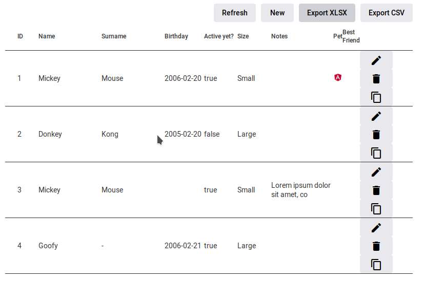

# NgxMatEditTable
Editable Angular Material Table component

This project contains both the library `ngx-mat-edit-table` and a `demo` client project.

Run `npm run build` to build the library. The build artifacts will be stored in the `dist/` directory.

Run `npm start` to serve demo project inside a dev server. Navigate to `http://localhost:4200/`. The app will automatically reload if you change any of the source files.

### API

See more docs at [library root](https://github.com/finsoft-java/ngx-mat-edit-table/tree/main/projects/ngx-mat-edit-table)

###

This project was generated with [Angular CLI](https://github.com/angular/angular-cli) version 11.2.6.
